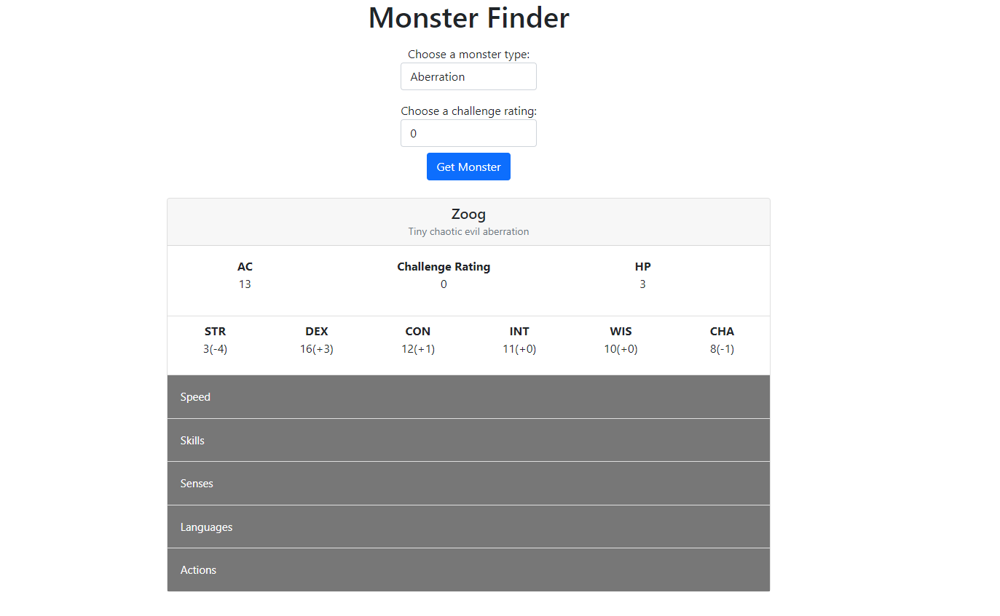

# Random Monster

# About Project

In a dungeons and dragons game there are many types of monsters.  Sometimes for your game you know what type of monster you want but can’t take a decision which to choose. Random Monster generator to the rescue.  Select monster type and challenge rating and a random monster will be fetched, click the button to get another monster of the same type.

# Technical Stack
 [![React][React.js]][React-url]
 [![Node][Node.js]][Node-url]
 [![Express][express]][express-url]
 [![Bootstrap][Bootstrap.com]][Bootstrap-url]
  [![Open5e][open5e]][open5e-url]
- 3rd Party API Used: 
[![Open5e][open5e]][open5e-url]
# Getting Started
## Prerequisites
- npm
```node
npm init [-y]
```

- Make sure both ports 3000 and 3001 are open
## Installation
- Inside the root of the project and then again inside the client directory run
```node
npm install
```
## Running the project
- Open a new terminal window inside the root of the project and run
```node
npm start
```

[React.js]: https://img.shields.io/badge/React-20232A?style=for-the-badge&logo=react&logoColor=61DAFB
[React-url]: https://reactjs.org/
[Bootstrap.com]: https://img.shields.io/badge/Bootstrap-563D7C?style=for-the-badge&logo=bootstrap&logoColor=white
[Bootstrap-url]: https://getbootstrap.com
[Node.js]: https://img.shields.io/badge/Node.js-339933?style=for-the-badge&logo=nodedotjs&logoColor=white
[Node-url]: https://nodejs.org
[express]: https://img.shields.io/badge/Express.js-000000?style=for-the-badge&logo=express&logoColor=white
[express-url]: https://expressjs.com
[open5e]: https://img.shields.io/badge/Open5e-FF6F00?style=for-the-badge&logo=open5e&logoColor=white
[open5e-url]: https://api.open5e.com/

